# Групповой проект 5 - детекция меланомы кожи - ISIC 2019/2020

Групповой проект 5. Задача - определить по снимку, является ли кожное образование меланомой. Данные взяты из соревнований ISIC 2019 и 2020.

Метрика: **AUC-ROC**. Целевой признак бинарный: 0 - доброкачественное, 1 - меланома.

---

## Структура репозитория

```
├── README.md
├── data
│   ├── ISIC_2019_Test_GroundTruth.csv
│   ├── ISIC_2019_Test_Metadata.csv
│   ├── ISIC_2019_Training_GroundTruth.csv
│   ├── ISIC_2019_Training_Metadata.csv
│   ├── ISIC_2020_Training_GroundTruth.csv
│   └── meta_and_target.parquet
├── notebooks
   ├── Conv.ipynb
   ├── Evaluate.ipynb
   ├── Multimodal.ipynb
   ├── Tabular.ipynb
   ├── conv
   │   ├── custom_model
   │   │   ├── checkpoints
   │   │   ├── data
   │   │   └── logs
   │   ├── resnet152
   │   │   ├── checkpoints
   │   │   ├── data
   │   │   └── logs
   │   ├── simple_cnn
   │   │   ├── checkpoints
   │   │   ├── data
   │   │   └── logs
   │   └── wandb
   ├── multimodal
   │   └── resnet152multimodal
   │       ├── checkpoints
   │       ├── data
   │       ├── logs
   │       └── wandb
   └── tabular
       ├── model1
       │   ├── checkpoints
       │   ├── data
       │   └── logs
       ├── model2
       │   ├── checkpoints
       │   ├── data
       │   └── logs
       └── model3
           ├── checkpoints
           ├── data
           └── logs
```

---

## Данные

Объединены три сплита из двух соревнований ISIC: тренировочная и тестовая часть 2019 года и тренировочная 2020-го. В каждой строке - один снимок, к которому прилагаются метаданные: возраст, пол и часть тела.

Разбивка: train/test/val 70/20/10 соотвественно, стратифицированная по классу и источнику данных. Классы несбалансированы - меланома составляет около 9% выборки.

---

## EDA

Несколько наблюдений из разведочного анализа.

По возрасту: основная масса пациентов в диапазоне 40–60 лет, у мужчин распределение сдвинуто вправо. Риск меланомы растёт монотонно с возрастом - от долей процента у молодых до ~25% в группе 85+.

По части тела: больше всего образований на торсе (30.5%), нижних (24.2%) и верхних конечностях (14.3%). Но наибольшая доля злокачественных - на ладонях/подошвах и боковом торсе (~26–27%).

---

## Модели

### Tabular

Только метаданные: возраст, пол, часть тела. Предобработка - OHE для локализации, OrdinalEncoder для пола, StandardScaler для возраста. Дисбаланс классов компенсируется взвешенным `BCEWithLogitsLoss`.

Обучали три варианта сети разной глубины: однослойная, двухслойная с Dropout, добавили BatchNorm и поменяли активации. 50 эпох, Adam lr=5e-4, batch 128.

### CNN

Только изображения. Три архитектуры: простая кастомная CNN, кастомная поглубже и предобученная ResNet-152 со своим классификатором.

### Multimodal

ResNet-152 для извлечения признаков из изображения, к которым конкатенируются табличные метаданные.

---

## Визуализация архитектур и метрик

Ниже вынесены схемы архитектур и основные графики качества для каждой модели.

### Simple CNN

Простая сверточная модель используется как бейзлайн, показывает, какой результат можно получить без предобученных сетей и сложной архитектуры.


<p align="center">
  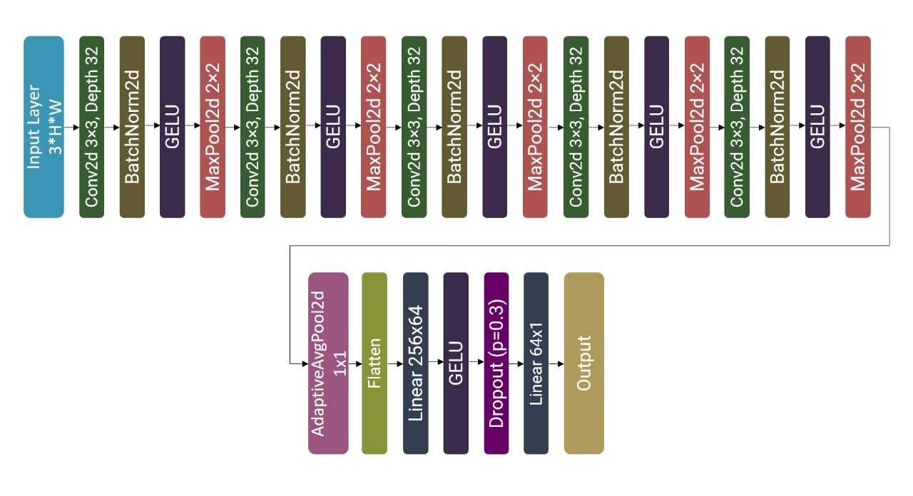
</p>


<p align="center">
  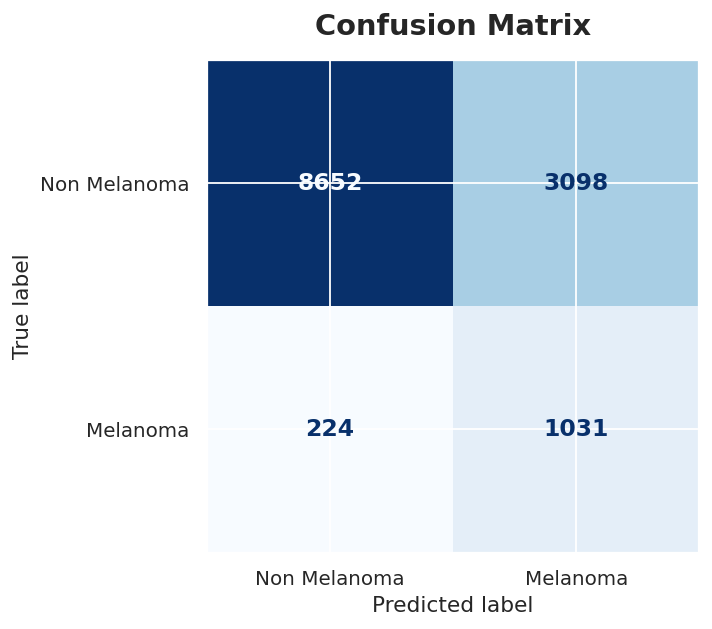
  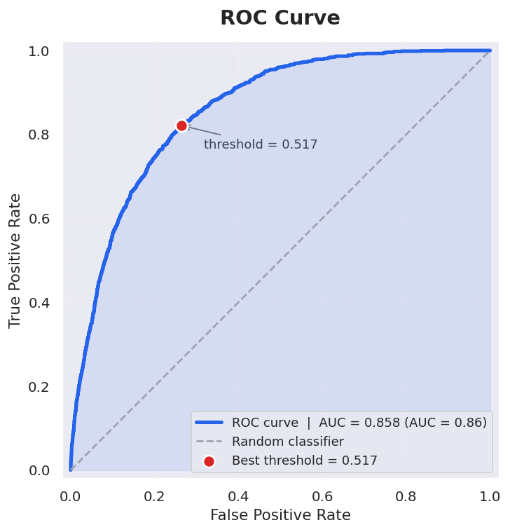
  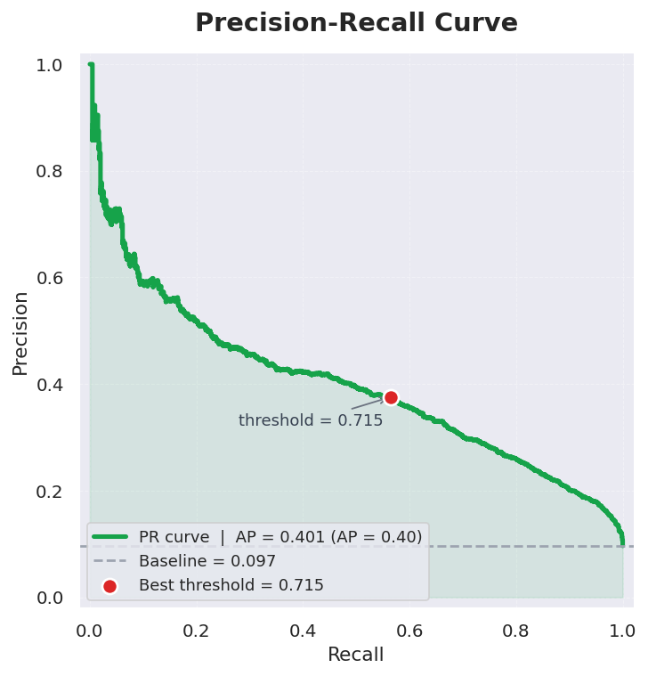
</p>

### Custom CNN

Кастомная CNN больше предыдущей модели: в ней больше слоев, а также есть residual блоки, поэтому она лучше извлекает признаки изображения, но обучается с нуля.


<p align="center">
  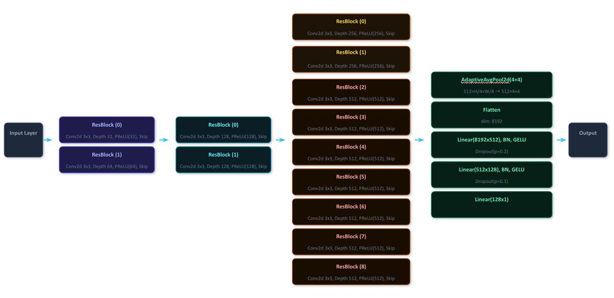
</p>


<p align="center">
  
  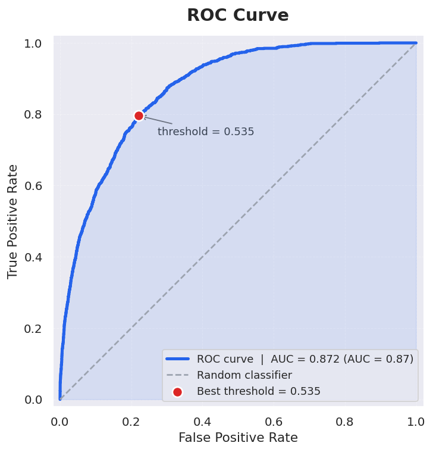
  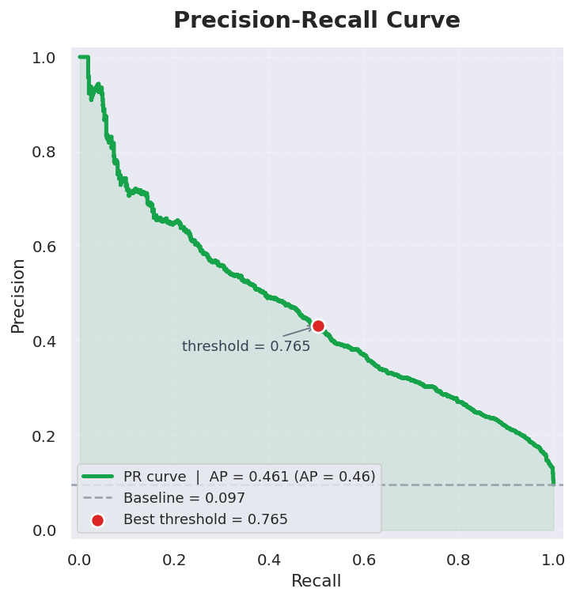
</p>

### ResNet-152

ResNet-152 используется как предобученная сверточная сеть.


<p align="center">
  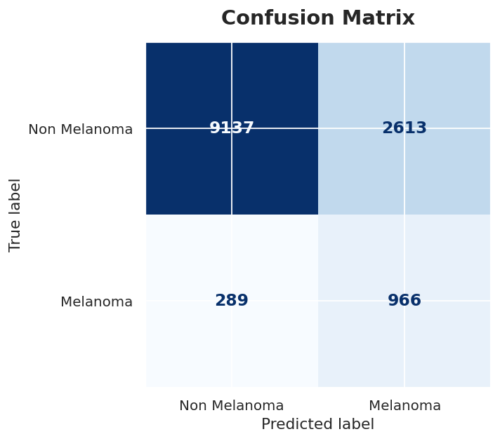
  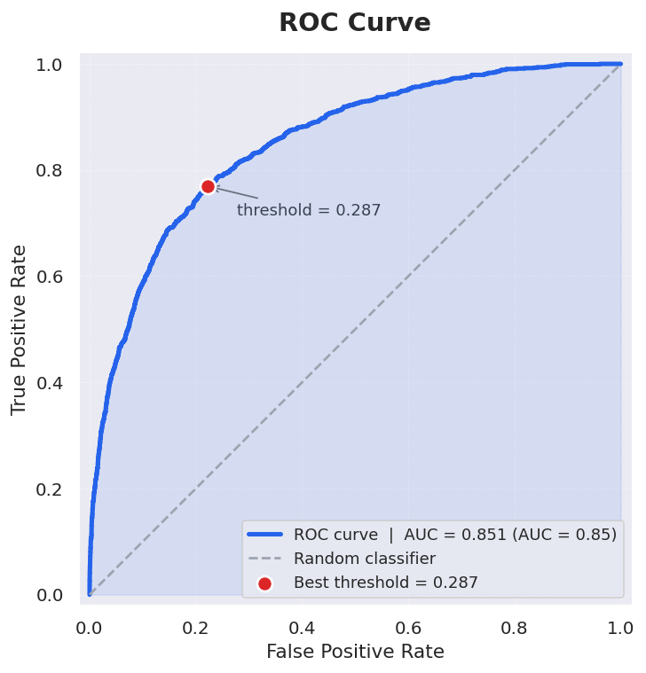
  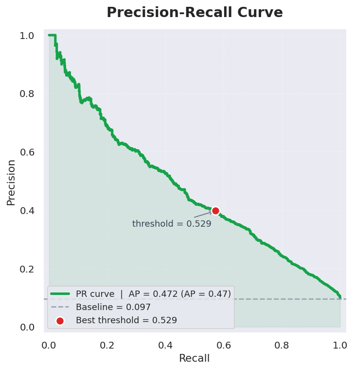
</p>

### Multimodal ResNet-152

Мультимодальная модель объединяет два источника информации: признаки из ResNet-152 и метаданные пациента.


<p align="center">
  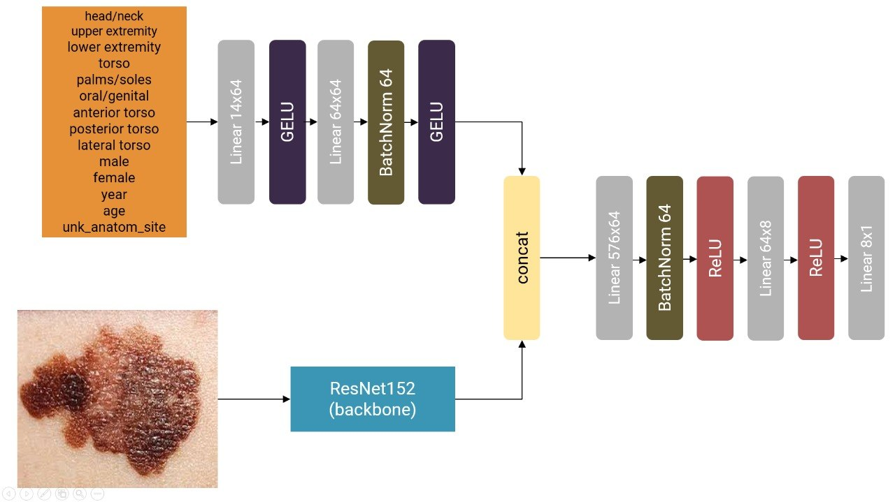
</p>


<p align="center">
  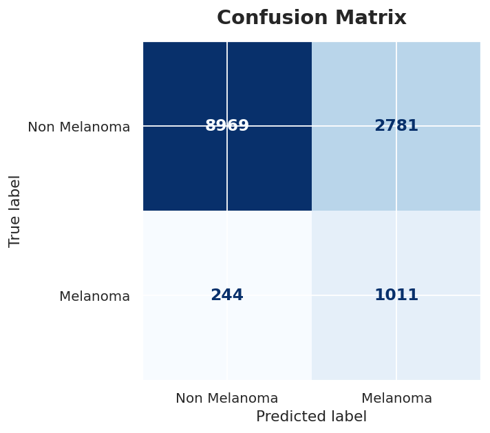
  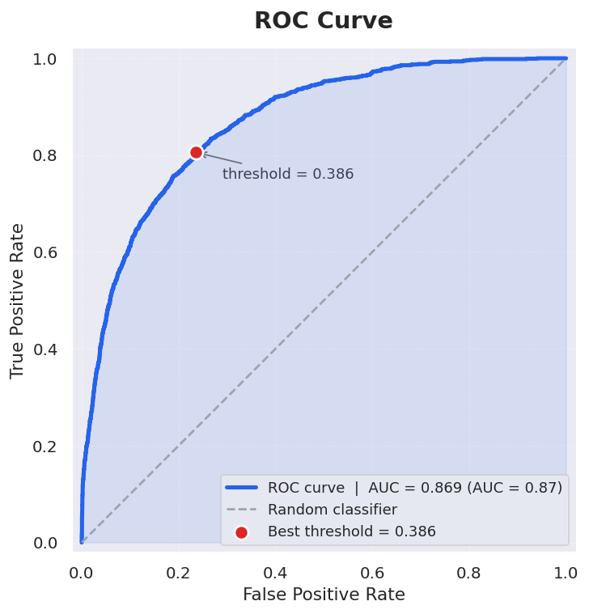
  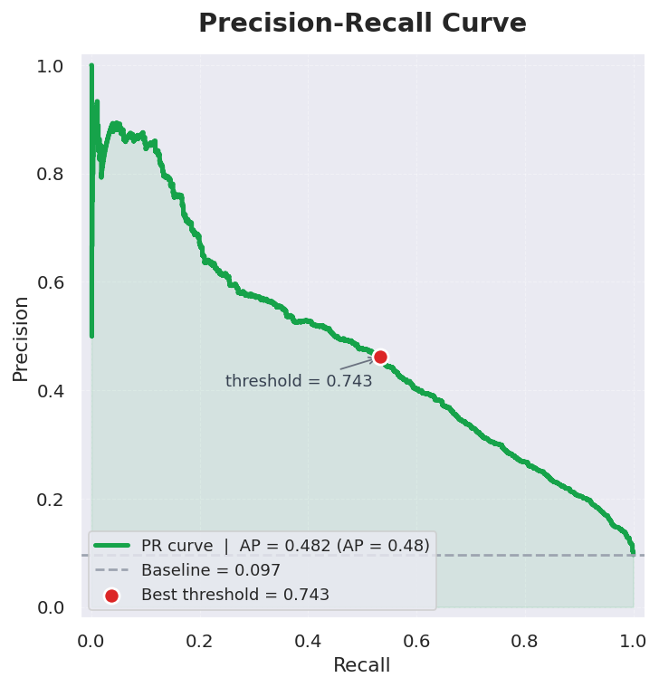
</p>

---

## Результаты

Сводная таблица ниже показывает итоговое качество моделей по AUC-ROC. Подробные графики качества для визуальных и мультимодальной моделей вынесены в раздел с визуализациями выше.

| Подход | Модель | test AUC-ROC |
|---|---|---|
| Tabular | однослойная | 0.59 |
| Tabular | двухслойная + Dropout | 0.57 |
| Tabular | с BN | 0.61 |
| Conv | простая CNN | 0.86 |
| Conv | кастомная CNN | 0.89 |
| Conv | ResNet-152 | 0.9 |
| **Multimodal** | **ResNet-152 + метаданные** | **0.91** |
